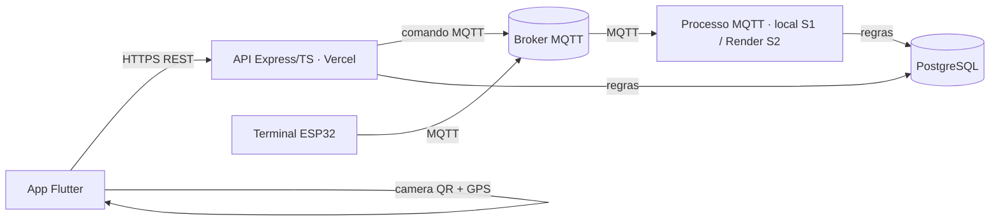

# ABP4 · Sistema de Controle de Acesso

[](https://github.com/ErrorSquad-ABP/ABP4-Sistema-Controle-Acesso/actions/workflows/ci-backend.yml)
[](https://github.com/ErrorSquad-ABP/ABP4-Sistema-Controle-Acesso/actions/workflows/ci-mobile.yml)
[](https://github.com/ErrorSquad-ABP/ABP4-Sistema-Controle-Acesso/actions/workflows/ci-firmware.yml)

Sistema integrado de baixo custo para controle de acesso em edifícios, com arquitetura prevista de terminal ESP32 (QR rotativo + NFC), app Flutter e backend Node/TypeScript por REST e MQTT. Este monorepo reúne backend, mobile, firmware, infraestrutura e documentação do projeto.

## Estado atual — 11/11/2026

- **Backend:** login JWT/RBAC, usuários, autorizações, QR assinado de 25 s, decisão de acesso, histórico, outbox e processamento MQTT implementados. Entraram o perfil editável (só nome, `PATCH /me`), a listagem autenticada de locais ativos e o cadastro de local por ADMIN (`GET`/`POST /locations`, raio de 1–100 m). A suíte tem **433 testes aprovados e 40 pulados** (os que exigem banco configurado). A API de produção roda no commit `a0625d7` com `database: ok`.
- **App:** as **12 telas do Figma** (claro/escuro) estão implementadas — entrar, minhas autorizações, detalhe, escanear QR, liberado, negado, perfil, locais, novo local, vazio, carregando e erro —, além do shell com abas **Autorizações/Histórico/Perfil**. As telas de administração de autorizações (US-30) e de usuários + histórico (US-31) não têm frame no Figma e seguem o design system. A Home antiga foi removida; as rotas novas são `/scan`, `/locais`, `/admin/autorizacoes`, `/admin/usuarios` e `/autorizacoes/:id`. São **640 testes** de Flutter, e o app foi executado em aparelho físico (Motorola g86 5G, Android 15) com APK debug e `adb reverse` — ver [`us-29-aparelho.md`](docs/entrega/evidencias/us-29-aparelho.md).
- **Terminal:** o NFC RC522 foi integrado (US-23, #67), com leitura, publicação MQTT e feedback de decisão; a evidência física inicial existe, mas o servo estava desabilitado nesse perfil. Servo/cancela física continua **não implementada**. GPS e heartbeat (US-24) e a resiliência offline (US-25) seguem pendentes. O TLS do broker foi validado no ESP32 contra o EMQX (DT-06).
- **Operação:** a API pública respondeu em 11/11 com `version: a0625d7` e `database: ok`. O worker `abp4-mqtt-worker` está **LIVE no Render**, com `mqtt conectado` no EMQX Cloud (TLS 8883) e `/healthz` ok; Neon e EMQX Cloud completam a infraestrutura. `QR_TOKEN_SECRET` e `JWT_SECRET` foram rotacionados em 11/11, sem valores versionados. A continuidade do serviço não foi medida — ver [`us-37.md`](docs/entrega/evidencias/us-37.md).
- **Trello:** US-28, US-30, US-31 e US-39 estão em **Concluído**, com comentário de evidência. A contagem viva do board deve ser lida no Trello; permanecem ressalvas de aceite em US-22 (demonstração visual) e no fluxo físico completo.

Conferência dos cards, evidências, testes e pendências em [`docs/entrega/auditoria-estado-atual.md`](docs/entrega/auditoria-estado-atual.md), com o retrato do fechamento em [`docs/entrega/review-2.md`](docs/entrega/review-2.md). Código integrado, simulação e operação real são tratados separadamente; o fluxo app → terminal real ainda não foi demonstrado, e a abertura física da cancela não está implementada.

## Arquitetura


```mermaid
flowchart LR
  A[App Flutter] -- HTTPS REST --> B[API Express/TS · Vercel]
  A -- camera QR + GPS --> A
  T[Terminal ESP32] -- MQTT --> M[(Broker MQTT)]
  M -- MQTT --> W[Processo MQTT · local S1 / Render S2]
  B -- comando MQTT --> M
  B -- regras --> DB[(PostgreSQL)]
  W -- regras --> DB
```

Na S1 o processo MQTT roda localmente (US-04); na S2 foi preparado para o Render (US-37, PR #26) e, em 11/11, o serviço `abp4-mqtt-worker` foi observado **LIVE** com `mqtt conectado` no EMQX TLS e `/healthz` ok — a continuidade não foi medida ([`us-37.md`](docs/entrega/evidencias/us-37.md)). A Vercel hospeda só a API. O polling de recuperação da outbox roda apenas entre **18:45 e 23:05** em `America/Sao_Paulo` (DT-21, PR #45); isso não bloqueia publicação imediata, consultas normais ou expurgos. Detalhes dos fluxos de acesso (QR e NFC), dos ambientes e da matriz de transporte em [`docs/architecture/visao-geral.md`](docs/architecture/visao-geral.md); tópicos, payloads, QoS e expiração do MQTT em [`docs/architecture/contratos-mqtt.md`](docs/architecture/contratos-mqtt.md).

## Estrutura do monorepo

As pastas abaixo existem; funcionalidades previstas dentro delas são identificadas explicitamente.

```text
ABP4-Sistema-Controle-Acesso/
├─ backend/                  Node + Express + TypeScript
│  ├─ src/                   domain · application · infrastructure · main · shared
│  ├─ prisma/                schema.prisma · migrations · seed.ts
│  └─ tests/                 unit/ · integration/
├─ mobile/                   Flutter
│  ├─ lib/                   core/ · app/shell/ · features/ (auth, scanner, authorizations,
│  │                         locations, profile, admin_authorizations, admin_users)
│  └─ test/ · pubspec.yaml
├─ firmware/                 ESP32 · PlatformIO (C++); validação física na US-34
│  ├─ src/                   main.cpp + modules/ (mqtt, display, nfc, gps, feedback, door)
│  ├─ include/               config.example.h (WiFi/broker/tópicos — sem segredos)
│  ├─ wokwi/                 diagram.json + wokwi.toml
│  └─ platformio.ini
├─ docs/
│  ├─ scrum/                 processo, product-backlog, DoD, sprints e templates
│  ├─ architecture/          visao-geral.md · contratos-mqtt.md · modelo-dados.md · adr/
│  ├─ api/                   openapi.yaml (gerado) · README.md — contrato REST v1
│  └─ guides/                desenvolvimento.md · como-rodar.md · deploy.md
├─ infra/                    docker-compose.dev.yml (Mosquitto + Postgres) · mosquitto/
├─ design/                   export de assets do Figma
├─ .github/
│  ├─ workflows/             ci-backend.yml · ci-mobile.yml · ci-firmware.yml ·
│  │                         cd-backend.yml · trello-link.yml
│  └─ CODEOWNERS · PULL_REQUEST_TEMPLATE.md · ISSUE_TEMPLATE/
└─ README.md · .gitignore · .editorconfig
```

**Regra de dependência (backend)**: `domain` não importa nada externo; `application` importa só `domain`; `infrastructure` implementa os contratos; `main` monta tudo. Casos de uso não conhecem Express, Prisma ou MQTT — falam via interfaces.

## Stacks

| Área | Stack | Observações |
|---|---|---|
| Backend | Node LTS + Express + TypeScript, Prisma + PostgreSQL, Zod, mqtt.js, JWT, Vitest | Versões pinadas na implementação conforme docs atuais |
| Mobile | Flutter, Riverpod, go_router, `mobile_scanner` (QR), `geolocator` | Android é o alvo principal da entrega |
| Firmware | ESP32, PlatformIO (C++/Arduino), módulos por responsabilidade, Wokwi p/ simulação | Reaproveita lógica do sketch legado (servo/LED/buzzer) |
| Infra dev | docker-compose: Eclipse Mosquitto + PostgreSQL | Espelha o legado; atende RP12 |
| Infra prod | **Vercel** (API serverless) · **Render** (worker MQTT) · **Neon** (Postgres) · EMQX Cloud (MQTT TLS) | Free tiers; atende RNF06, RP11, RNF02 · ver `docs/architecture/adr/001` |

## Como rodar localmente

Passo a passo de ambiente, infraestrutura e execução em [`docs/guides/como-rodar.md`](docs/guides/como-rodar.md).

## Documentação

- [`docs/entrega/auditoria-estado-atual.md`](docs/entrega/auditoria-estado-atual.md) — estado em 02/11/2026 e auditoria dos concluídos no Trello.
- [`docs/scrum/README.md`](docs/scrum/README.md) — como o time aplica Scrum (backlog, DoD, sprints e templates).
- [`docs/entrega/review-1.md`](docs/entrega/review-1.md) — documento de entrega da Review 1 (Sprint 1).
- [`docs/entrega/review-2.md`](docs/entrega/review-2.md) — documento de entrega da Review 2 (Sprint 2), com o estado de 11/11.
- [`docs/scrum/sprints/sprint-2.md`](docs/scrum/sprints/sprint-2.md) — fechamento da Sprint 2 · [review](docs/scrum/sprints/sprint-2-review.md) · [retro](docs/scrum/sprints/sprint-2-retro.md).
- [`docs/entrega/README.md`](docs/entrega/README.md) — índice das evidências por card (`docs/entrega/evidencias/`).
- [`docs/entrega/matriz-requisitos.md`](docs/entrega/matriz-requisitos.md) — matriz do edital (RF, RNF e RP) com status e lacunas.
- [`docs/architecture/visao-geral.md`](docs/architecture/visao-geral.md) — arquitetura, fluxos de acesso e matriz de transporte.
- [`docs/architecture/contratos-mqtt.md`](docs/architecture/contratos-mqtt.md) — contrato MQTT v1 (tópicos, payloads, QoS, ids e expiração).
- [`docs/architecture/modelo-dados.md`](docs/architecture/modelo-dados.md) — diagrama ER do modelo Prisma v1.
- [`docs/guides/desenvolvimento.md`](docs/guides/desenvolvimento.md) — branches, commits, PRs, review e CI.
- [`docs/architecture/caso-de-uso-modelo.md`](docs/architecture/caso-de-uso-modelo.md) — como estender o backend (camadas, erros, env, testes).

## Equipe

**ErrorSquad** · ABP 2026-2 · 4DSM · FATEC Jacareí — SM: João Victor Lopes Rosa ([@JV-L0pes](https://github.com/JV-L0pes)) · PO: Felipe Pacheco ([@FelipePacheco30](https://github.com/FelipePacheco30)) · Devs: [@Carlos-Santo](https://github.com/Carlos-Santo), [@Caiuuutecnologico](https://github.com/Caiuuutecnologico), [@Leo-Slv](https://github.com/Leo-Slv), [@ArtFacchinetti](https://github.com/ArtFacchinetti).
